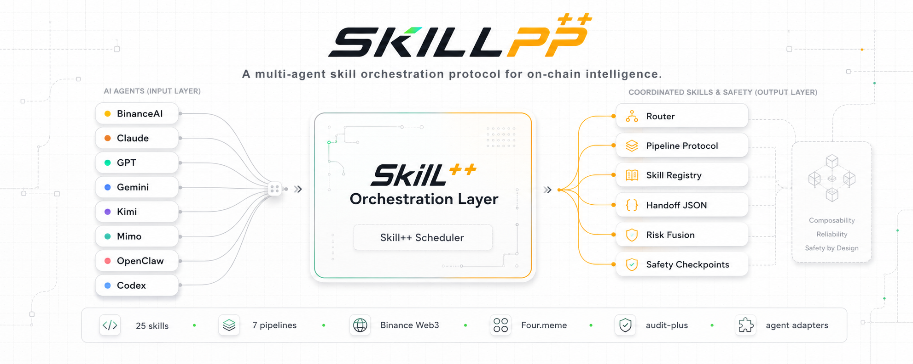

# Skill++

**A multi-agent skill orchestration protocol for on-chain intelligence.**



Skill++ turns isolated AI skills into coordinated workflows for token research, wallet review, smart-contract audit, smart-money tracking, chain scanning, and guarded write-operation handoff.

[简体中文](README.zh-CN.md) | [Website](https://skillpp.ai) | [X](https://x.com/SkillppAI) | [GitHub](https://github.com/skillpp/skillpp)


## Overview

Current status: v0.1 public npm release.

AI skills are useful on their own, but production-grade on-chain analysis needs routing, sequencing, cross-checking, safety gates, and structured handoff. Skill++ provides that coordination layer.

Skill++ is a protocol-first AI skill package. Some skills run local read-only CLIs; some call public read-only APIs; others emit structured handoff for agent-side execution. It is not a wallet, exchange, or Four.meme SDK, and it must not report a write operation as complete unless the required external tool actually ran.

| Layer | What Skill++ Provides |
|---|---|
| Router | Parses URLs, addresses, symbols, source snippets, wallets, and natural-language intents |
| Pipeline Protocol | Maps requests to 7 stable pipeline IDs |
| Skill Registry | Registers 25 skills across Binance Web3, Binance Exchange, Four.meme, audit-plus, and Skill++ modules |
| Handoff | Emits structured JSON so downstream skills can continue without losing context |
| Risk Fusion | Cross-checks quick audit, deep audit, market data, smart-money signals, and wallet exposure |
| Safety | Blocks sensitive actions behind checkpoints and explicit user confirmation |
| Agent Adapters | Provides loading guidance for BinanceAI, Claude, GPT, Gemini, Kimi, Mimo, OpenClaw, and Codex |

Skill++ is designed for both expert agents and users who do not know Web3 terminology. The agent can explain risk in plain language while still preserving machine-readable execution state.

## Install

Install from npm:

```bash
npm install -g skillpp
skillpp doctor
skillpp skills
```

GitHub source install:

```bash
npm install -g github:skillpp/skillpp
skillpp doctor
skillpp skills
```

Local repository use:

```bash
git clone https://github.com/skillpp/skillpp.git
cd skillpp
npm install -g .
skillpp doctor
```

## Use With AI Agents

Skill++ is a skill package, not only a CLI. After installation or cloning, point the AI agent at the package root and ask it to read `SKILL.md` first. If an agent only reads this README, it has seen the product overview but has not loaded the Skill++ protocol.

Minimum loading prompt:

```text
Use Skill++ from this repository. Read SKILL.md first, then skillpp.manifest.json and the matching adapter under adapters/ for your runtime. Use scripts/skillpp.mjs --dry-run when deterministic routing is available.
```

The npm package includes `SKILL.md`, `skillpp.manifest.json`, `schemas/`, `adapters/`, `prompts/`, `skills/`, and the `skillpp` CLI, so compatible agents can learn the protocol directly from the installed package or the GitHub repository.

## Quick Start

```bash
# Token analysis: metadata -> quick audit -> smart-money signal -> risk fusion
skillpp analyze "0x55d398326f99059ff775485246999027b3197955" --dry-run

# Chain scan: launchpad signals -> market rankings -> risk filtering -> opportunity board
skillpp scan 56 --dry-run

# Pre-trade safety check: audit -> risk fusion -> confirmation checkpoint
skillpp trade "0x55d398326f99059ff775485246999027b3197955" --dry-run

# Four.meme creation flow: safety notice -> creation checkpoint
skillpp create "create a meme token on four.meme" --dry-run
```

Minimal expected output shape:

```text
$ skillpp parse "0x55d398326f99059ff775485246999027b3197955"
{
  "command": "parse",
  "parsed": {
    "type": "address",
    "contractAddress": "0x55d398326f99059ff775485246999027b3197955"
  }
}

$ skillpp analyze "0x55d398326f99059ff775485246999027b3197955" --dry-run
Pipeline: P_TOKEN_ANALYSIS
Steps: query-token-info -> query-token-audit -> trading-signal -> risk-fusion
Checkpoint: AUDIT_RESULT
Handoff: { "_meta": { "pipeline": "P_TOKEN_ANALYSIS" }, "results": { ... } }
```

## Demos

- [Raw Contract Audit Demo: BSC LastGodVault](examples/contract-audit-bsc-lastgodvault.raw.md)
- [Raw Chain Scan Demo: BSC](examples/chain-scan-bsc.raw.md)

## Privacy-Safe Doctor

`skillpp doctor` is safe to paste into public issues by default. It reports package health without exposing absolute local paths.

```bash
skillpp doctor
```

Default output redacts local paths:

```json
{
  "command": "doctor",
  "packageRoot": "<redacted>",
  "checks": {
    "skillsDir": { "path": "skills", "exists": true }
  }
}
```

Use absolute paths only in a private local session:

```bash
skillpp doctor --show-paths
```

Do not paste `--show-paths` output into public GitHub issues, chat logs, or bug reports.

## Naming

The formal name is **Skill Plus Plus (Skill++)**.

| Name | Use |
|---|---|
| Skill++ | Product name and documentation name |
| Skill Plus Plus | Plain-English full name |
| `skillpp` | npm package name and CLI command |
| `skillpp/` | Recommended repository or local folder name |

## Architecture

```text
User input
  URL / address / symbol / source code / wallet / natural language
        |
        v
Skill++ scheduler
  1. Parse input type, chain, and address
  2. Check tools and dependencies
  3. Match a stable pipeline ID
  4. Run CLI, API, or text-based AI skills
  5. Trigger safety checkpoints
  6. Emit handoff JSON
  7. Recommend next routes
        |
        v
25 coordinated skills
  Binance Web3 / Binance Exchange / Four.meme / audit-plus / Skill++ Library
```

## Pipelines

| ID | Purpose | Sequence |
|---|---|---|
| `P_TOKEN_ANALYSIS` | Token analysis | token info -> token audit -> smart-money signal -> risk fusion |
| `P_CHAIN_SCAN` | Chain opportunity scan | meme rush -> market rank -> risk fusion -> opportunity board |
| `P_TRADE_SAFETY` | Pre-trade safety | token audit -> audit-plus -> risk fusion |
| `P_WALLET_XRAY` | Wallet analysis | wallet positions -> per-token risk -> wallet-doctor |
| `P_SMART_MONEY` | Smart-money tracking | trading signal -> token risk -> risk fusion |
| `P_FOURMEME_CREATE` | Four.meme creation | integration flow -> safety checkpoint |
| `P_DEEP_AUDIT` | Deep contract audit | token info -> token audit -> contract-profiler -> audit-plus -> risk fusion |

Pipeline IDs are stable protocol identifiers. Skill++ does not rely on drifting numbered pipeline labels.

## Skill Inventory

| Group | Skills |
|---|---|
| Binance Web3 | `query-token-info`, `query-token-audit`, `query-address-info`, `trading-signal`, `crypto-market-rank`, `meme-rush`, `binance-agentic-wallet`, `binance-tokenized-securities-info` |
| Binance Exchange and Payments | `binance`, `fiat`, `p2p`, `payment`, `square-post`, `onchain-pay` |
| Four.meme | `four-meme-integration`, `four-meme-ai`, `four-guard` |
| Audit Core | `audit-plus` |
| Skill++ Library | `contract-profiler`, `risk-fusion`, `wallet-doctor`, `newbie-tutor`, `watchtower`, `opportunity-board`, `scam-pattern-lab` |

## Compatibility

Skill++ treats pipeline IDs, command routes, schemas, checkpoints, and default safety behavior as a public protocol. The v0.1 compatibility contract is documented in [COMPATIBILITY.md](COMPATIBILITY.md) and enforced by CI.

For v0.1 updates, add new skills, fields, prompts, adapters, or pipelines without renaming or removing existing public identifiers. Breaking changes require a new compatibility baseline; after `1.0.0`, they also require a new major version.

## Skill++ Library Modules

| Module | Role |
|---|---|
| `contract-profiler` | Profiles contract structure before deep audit |
| `risk-fusion` | Combines token audit, audit-plus, market, smart-money, wallet, and social signals |
| `wallet-doctor` | Diagnoses wallet portfolio health and exposure |
| `newbie-tutor` | Explains on-chain and audit terms using current context only |
| `watchtower` | Designs monitoring rules for addresses, contracts, and events |
| `opportunity-board` | Aggregates scan, ranking, smart-money, and risk-filtered candidates |
| `scam-pattern-lab` | Maps audit evidence to known on-chain scam patterns |

## AI Agent Compatibility

Skill++ uses `SKILL.md` as the primary AI entry point. Adapters and prompts are included for agent-specific loading.

| AI / Agent | Loading Path |
|---|---|
| BinanceAI | Read `SKILL.md`, then use `adapters/binance-ai.md` |
| Claude / Claude Code / Claude Opus | Read `SKILL.md`, then use `adapters/claude.md` |
| GPT / ChatGPT / Custom GPT | Use `adapters/gpt.md` or `prompts/universal-system-prompt.md` |
| Gemini | Use `adapters/gemini.md` |
| Kimi | Use `adapters/kimi.md` |
| Mimo | Use `adapters/mimo.md` |
| OpenClaw | Use `adapters/openclaw.md` |
| Codex | Read `SKILL.md`; run `scripts/skillpp.mjs` for deterministic routing |

## Write-Operation Boundary

The `skillpp` package includes the scheduler, protocol files, schemas, adapters, prompts, and bundled read-only helper scripts. It does not silently install wallet, exchange, or Four.meme write-operation tools.

Write-operation flows are checkpointed handoffs unless the user installs and explicitly invokes the matching external CLI.

Install external write-operation CLIs only when needed:

```bash
npm i -g @binance/agentic-wallet
npm i -g @binance/binance-cli
npm i -g @four-meme/four-meme-ai@latest
```

These provide `baw`, `binance-cli`, and `fourmeme`.

Without these tools, Skill++ can still parse, route, run read-only checks, audit, fuse risk signals, and emit checkpoints. It must not claim that a write operation succeeded when the required external CLI is unavailable.

## Safety Model

Skill++ can execute read-only Node CLIs for token lookup, rankings, smart-money data, and wallet positions. It does not silently execute operations involving:

- private keys, API keys, login state, transfers, swaps, orders, publishing, or posting
- high risk, conflicting results, or insufficient evidence
- any action where the user carries funds or identity risk

Sensitive actions produce structured checkpoints and require explicit user confirmation. Blocking checkpoints exit with code `10` in `scripts/skillpp.mjs`.

Skill++ output is for research and risk review only. It is not financial advice.

## Repository Layout

```text
skillpp/
├── README.md
├── README.zh-CN.md
├── COMPATIBILITY.md
├── package.json
├── SKILL.md
├── registry.md
├── pipelines.md
├── rules.md
├── skillpp.manifest.json
├── schemas/
├── scripts/
├── adapters/
├── prompts/
├── assets/
├── tests/
└── skills/
    ├── binance-web3/
    ├── binance/
    ├── four-meme/
    ├── audit-plus/
    └── skillpp/
```

Skill paths use `skills/<group>/<skill-name>/`.

## Release Checks

```bash
npm test
npm run validate
npm run compatibility
npm pack --dry-run
```

GitHub Actions runs the same checks on push, pull request, and manual dispatch.

## License

[MIT](LICENSE)
